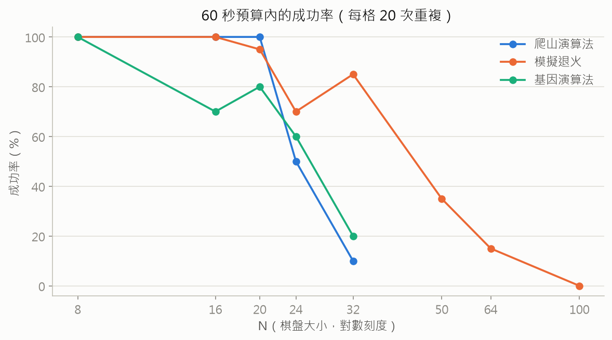
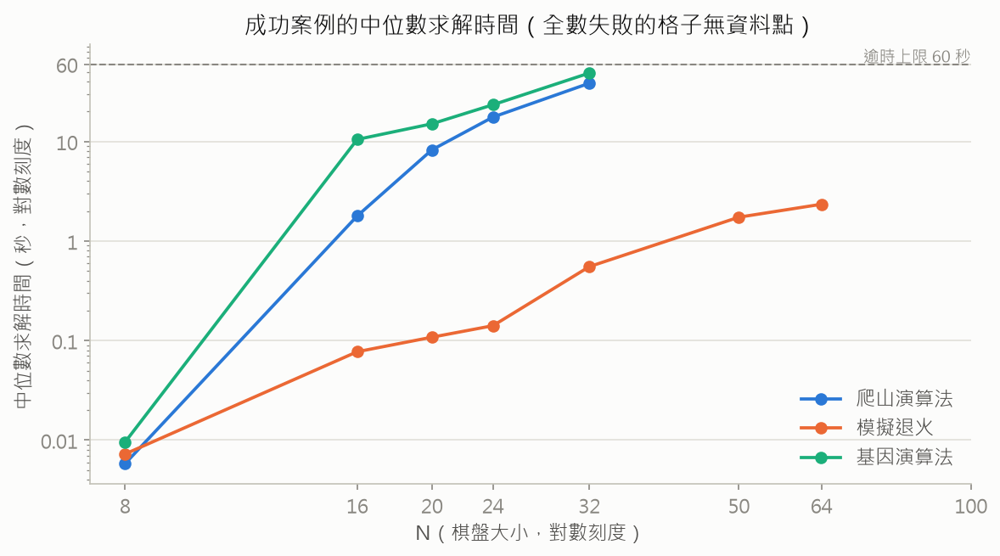
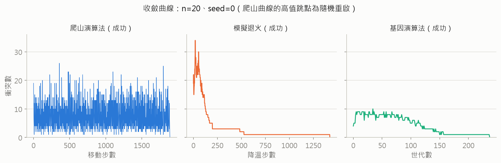

# N 皇后問題：三種啟發式演算法的實驗比較

以爬山演算法（Hill Climbing）、模擬退火（Simulated Annealing）、基因演算法（Genetic Algorithm）求解 N 皇后問題。三者實作在共用介面之下，於相同的 60 秒時間預算與固定 seed 下比較成功率、求解時間與收斂行為——結果顯示三者在 n=8 難分高下，規模一拉開卻以完全不同的方式失敗。

專案從四支各自獨立的求解腳本出發，逐步重構為共用介面的套件、加上單元測試，最後以 360 次可重現的實驗（3 種演算法 × 多個棋盤大小 × 每格 20 個固定 seed）量化三者的差異。

## 問題定義

在 N × N 的棋盤上放置 N 個皇后，使任兩個皇后互不攻擊（不同列、不同行、不同斜線）。

**狀態表示**：以長度為 n 的串列表示棋盤，`queens[i]` 代表第 i 直行的皇后所在橫列。這個表示法保證每行恰有一個皇后，同行衝突從表示法層面就被排除，搜索空間從任意擺放的 C(n², n) 縮減為 nⁿ；初始棋盤再用 0 到 n-1 的隨機排列產生，讓起點連同列衝突也沒有，只需要處理斜線衝突。

**目標函數**：互相攻擊的皇后對數（衝突數）。兩皇后衝突若且唯若同列（row 相同）或同斜線（列差等於行差），逐對檢查為 O(n²)。衝突數為 0 即為合法解，因此求解過程就是把目標函數最小化到 0 的組合最佳化。

```
範例：棋盤 [7, 5, 1, 3, 2, 4, 0, 6] 的衝突數為 9
```

三種演算法共用同一個 `SolveResult` 介面，回傳最終棋盤、衝突數、迭代次數、耗時與逐步衝突數軌跡（`history`），收斂曲線即由此繪出。

## 三種演算法

### 爬山演算法（最陡爬升＋隨機重啟）

每一步掃描整個鄰域——n 行 × (n-1) 個新位置共 n(n-1) 個鄰居——移動到衝突數最少的那個；沒有更好的鄰居時代表卡在局部最佳解或高原，隨機重啟。

| 參數 | 預設值 |
|---|---|
| `max_restarts` | 1000 |

**成本結構**：單步要評估 O(n²) 個鄰居、每個鄰居的衝突計算又是 O(n²)，單步成本為 O(n⁴)。這使爬山法成為三者中對 N 最敏感的演算法，實驗中可以清楚看到它的可行性邊界。

### 模擬退火（幾何降溫）

每一步隨機挑一個鄰居：比目前好就無條件接受，比目前差則以 exp(Δe / t) 的機率接受。溫度以 t ← 0.95 t 幾何遞減，前期容忍劣解以跳出局部最佳解，後期趨於貪婪。

| 參數 | 預設值 |
|---|---|
| `t_start` | 100.0 |
| `alpha`（降溫速率） | 0.95 |
| `t_min`（終止溫度） | 1e-300 |

**實作重點**：初版的終止條件寫 `while t > 0`，數學上 t 永遠大於 0，程式其實是靠浮點數下溢到 0 才停，約 1.46 萬步——迭代預算隱含在浮點格式裡。重構時改為顯式的 `t_min` 參數（預設值對應約 1.36 萬步，維持相近預算）。另一個觀察：t 降到約 0.01 以下（約第 180 步起）接受劣解的機率已趨近於 0，所以這條退火曲線的絕大部分時間其實是「只接受更好隨機鄰居」的貪婪搜索，真正的退火只發生在前段。

### 基因演算法（含自適應突變率）

以衝突數倒數 1/(conflicts+1) 作為適應度做輪盤式選擇，單點交配產生子代，突變則隨機移動一行的皇后。

| 參數 | 預設值 |
|---|---|
| `pop_size`（族群大小） | 1000 |
| `max_gen`（最大世代數） | 10000 |
| 突變率 | 0.2 起，自適應調升至 0.4 |

**實作重點**：自適應突變率是標準流程之外額外加入的機制——族群最佳衝突數一有進步就把突變率重設回 0.2；停滯超過 100 代後每 50 代調高 0.05、上限 0.4，用提高擾動幫助族群跳出停滯。

## 實驗設計

| 項目 | 設定 |
|---|---|
| 棋盤大小 N | 爬山、基因：{8, 16, 20, 24, 32}；模擬退火：{8, 16, 20, 24, 32, 50, 64, 100} |
| 重複次數 | 每格 20 次，seed = 0 到 19，結果可完全重現 |
| 時間預算 | 單次求解 60 秒，逾時記為失敗 |
| 演算法參數 | 三者皆用上表預設值，不隨 N 調整 |
| 環境 | Windows 11、Python 3.12（純標準庫實作，未用 numpy）、Intel Core i7-8565U、16 GB RAM |

模擬退火因單步成本低（每步只評估一個鄰居），額外測到 N=100 以觀察固定迭代預算下成功率如何衰減。網格與逾時上限是先以校準試跑定案的：爬山法在 n=32、基因演算法在 n=32 都已貼近 60 秒預算的極限，保留這些格子正是為了呈現可行性邊界。

## 結果與分析

### 成功率



三條曲線對應三種不同的失敗模式：

- **爬山演算法**：n ≤ 20 全數成功，n=24 跌到 50%、n=32 只剩 10%。瓶頸不在搜索策略，在單步成本——全鄰域掃描是 O(n⁴)，n=32 時每步接近 0.1 秒，60 秒跑不完幾次重啟。失敗案例的最終衝突數散佈在 2 到 26 之間：是時間到了還在半路，不是差一步。
- **模擬退火**：n ≤ 32 維持在 70% 到 100%，n=50 開始崩、n=100 全數失敗。失敗的樣子和爬山完全不同——幾乎全卡在剩 1 個衝突（n=50 的 13 次失敗中有 12 次、n=64 的 17 次中有 11 次）。原因是固定的迭代預算：接近解時，隨機提案要恰好命中能消掉最後衝突的那幾格，單步命中率只有 n(n-1) 分之幾。成功案例的中位迭代數也從 n=8 的 449 步一路爬到 n=50 的 9,394 步，離 1.36 萬步的天花板越來越近，到 n=100 全部撞頂。
- **基因演算法**：n=16 起就在 60% 到 80% 徘徊，n=32 剩 20%，失敗案例同樣多卡在剩 1 至 2 個衝突。它輸在每代成本：1,000 個個體都要重算衝突數，n=32 一代就要近半秒，60 秒內演化不了幾百代。

一點統計上的提醒：每格 20 次重複、粒度 5%，模擬退火在 20→24→32 的 95%→70%→85% 起伏屬取樣噪音，讀趨勢即可，不必讀單點。

### 求解時間



對數座標下三條線的斜率差異就是成本結構的差異。模擬退火每步只評估一個鄰居，中位時間到 n=64 都還在 2.3 秒；爬山和基因在 n=32 的中位時間（38.5 秒、48.8 秒）已貼著 60 秒上限，曲線再往右就沒有資料點了。

另一個值得注意的點：快不等於能解。模擬退火在 n=100 跑完全部約 1.36 萬步只需 9 秒左右，卻 20 次全數失敗——它的預算單位是迭代數而不是秒數，時間還很充裕，步數先用完了。

### 完整數據

| 演算法 | N | 成功率 | 中位數求解時間（秒） |
|---|---|---|---|
| 爬山演算法 | 8 | 100% | 0.01 |
| 爬山演算法 | 16 | 100% | 1.79 |
| 爬山演算法 | 20 | 100% | 8.25 |
| 爬山演算法 | 24 | 50% | 17.62 |
| 爬山演算法 | 32 | 10% | 38.54 |
| 模擬退火 | 8 | 100% | 0.01 |
| 模擬退火 | 16 | 100% | 0.08 |
| 模擬退火 | 20 | 95% | 0.11 |
| 模擬退火 | 24 | 70% | 0.14 |
| 模擬退火 | 32 | 85% | 0.55 |
| 模擬退火 | 50 | 35% | 1.74 |
| 模擬退火 | 64 | 15% | 2.34 |
| 模擬退火 | 100 | 0% | － |
| 基因演算法 | 8 | 100% | 0.01 |
| 基因演算法 | 16 | 70% | 10.50 |
| 基因演算法 | 20 | 80% | 15.08 |
| 基因演算法 | 24 | 60% | 23.43 |
| 基因演算法 | 32 | 20% | 48.77 |

### 收斂行為



三條曲線各有值得停下來看的地方（n=20、seed=0，可完全重現）：

- **爬山**：密集鋸齒是一次次重啟的下降段。這一跑走了近 1,900 步、上百次重啟，最後在某次重啟的下降途中直落到 0——隨機重啟的運氣成分在圖上一目了然。
- **模擬退火**：前約 180 步的高溫期會接受劣解，衝突數劇烈震盪、一度衝上 35；溫度失效後轉為貪婪下降，接著在低衝突區走出長長的平台，約 1,400 步收斂。與演算法一節的推算一致——真正的「退火」只發生在前段。
- **基因**：1,000 個隨機排列的初始族群，最佳個體只有 2 個衝突，但接下來不降反升到 7 至 9。這個實作沒有菁英保留（elitism），輪盤選擇不保證最佳個體活進下一代，交配也會拆散好的組合；之後靠選擇壓力與自適應突變才階梯狀降回 0。「初始就很好」和「穩定收斂」是兩回事。

## 重現方式

```bash
pip install -r requirements.txt

# 單元測試（16 個案例：衝突計算、解合法性、seed 重現性、逾時路徑）
python -m pytest -q

# 跑完整 benchmark，約 1 至 2 小時（視機器而定），逐列寫入可中斷
python experiments/run_benchmark.py

# 由 benchmark 數據產出三張圖與數據表
python experiments/make_charts.py
```

也可以直接呼叫求解器：

```python
from nqueens import simulated_annealing

result = simulated_annealing.solve(20, seed=0)
print(result.solved, result.conflicts, result.iterations, result.solution)
```

## 專案結構

```
├── nqueens/                     核心套件
│   ├── core.py                  棋盤表示、衝突計算、SolveResult
│   ├── hill_climbing.py         爬山演算法（最陡爬升＋隨機重啟）
│   ├── simulated_annealing.py   模擬退火（幾何降溫）
│   └── genetic_algorithm.py     基因演算法（自適應突變率）
├── experiments/
│   ├── run_benchmark.py         實驗網格 → results/benchmark.csv
│   └── make_charts.py           benchmark 數據 → docs/images/*.png
├── tests/                       單元測試
├── results/benchmark.csv        360 次實驗的原始數據
└── docs/images/                 README 引用的圖表
```

## 後記

這個專案的第一版只有一個目標：把解找出來。後來重做，想回答的其實是「為什麼有時候找不到」。三種演算法在 n=8 看起來不相上下，規模一拉開，失敗的方式卻完全不同——爬山卡在單步太貴，退火卡在步數配額用完，基因卡在一代成本太高、還會把好不容易出現的優秀個體弄丟。比起成功率數字本身，這些失敗模式更能說明每個演算法的性格。

另一個收穫：整份報告裡最有意思的兩個發現——模擬退火其實靠浮點下溢終止、基因演算法的族群最佳會不降反升——都不是事先設計的實驗目標，是重構程式和畫收斂曲線時才撞見的。把過程量化、視覺化，本身就會長出新的理解。

## 未來方向

- **min-conflicts**：N 皇后的經典局部搜索演算法，適合作為對照組
- **增量衝突計算**：移動一個皇后只影響 O(n) 對關係，鄰居評估可從 O(n²) 全量重算降為 O(n) 差分更新，爬山法單步成本可望從 O(n⁴) 降一個數量級
- **讓預算隨 N 擴張**：模擬退火的失敗多半是「差一兩個衝突收不掉」，降溫更慢或加入重啟機制應能把可解範圍往上推
- **菁英保留**：收斂曲線顯示族群最佳個體會倒退，每代保留前幾名進入下一代，應能明顯穩定基因演算法的收斂
- **排列保持型交配**：單點交配會破壞「每列恰一皇后」的排列性質，改用 OX / PMX 等交配子值得比較
